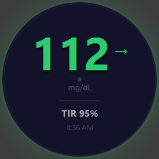
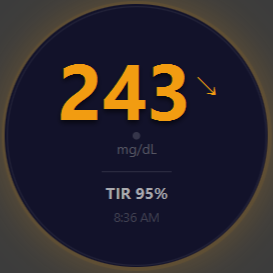
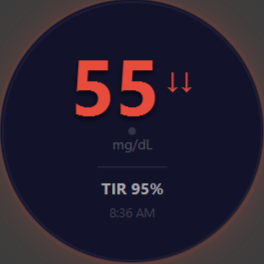

# DexTrack
I got tired of opening my phone when working to check my blood sugar, and then getting sucked down a rabithole of doom scrolling, so I built this.

A little always-on desktop widget that shows your blood glucose readings, the trend arrow, and your time-in-range for the day. It's basically a small floating circle that sits in the corner of the screen so I can keep an eye on my numbers when working.

## Pics

<p align="center">
  
  
  
</p>

## What it does

- Shows your current glucose in big text, colored depending on current number
- Trend arrow so you can see which way it's going
- Time in range (TIR) for the last 24 hours
- When it was last updated

It auto-refreshes every 5 minutes. You can also right-click it to log out.

## How it actually works

It uses the official [Dexcom Developer API](https://developer.dexcom.com) with OAuth2. You log in through Dexcom's official page in your browser one time, and then it saves the token locally so you don't have to keep logging in. The readings come from the `/v3/users/self/egvs` endpoint.

The OAuth part was the most annoying to get right. When you hit login, the app actually starts a tiny local web server on port 9000 just to catch the redirect that Dexcom sends back with your auth code. Took me a while to realize I had to shut that server down properly or the next login would crash with "address already in use."

## Running it

You'll need:
- Java 17+
- Maven
- Dexcom developer app (free) from [developer.dexcom.com](https://developer.dexcom.com), which gives you a Client ID and Client Secret

```
http://localhost:9000/callback
```

Then:

```bash
git clone https://github.com/noahcunni/DexTrack.git
cd DexTrack
mvn javafx:run
```

When you run it for the first time you run it you'll get a login window. Paste in your Client ID and Secret, click Login, log in through the browser, and the widget pops up.

## About your data

Your tokens only get sent to dexcom, log in information is stored locally.

## Stuff that tripped me up (so it doesn't trip you up)

- **"Max User Count Exceeded"** isn't a bug in the app. A dexcom developer account only allows one authorized user per app. This means if you mess up your authorization after getting your developer access approved, your cooked. Email dexcom and they *should* fix it. 
- Log in with a real **Dexcom user account** (the one from the phone app), *not* your developer-portal login. Found that out the hard way, they're two totally separate accounts.

## Tech I used

- Java 17 + JavaFX 21 for the UI
- Gson for parsing the JSON
- Java's built-in HttpClient for the API calls

## Note

Just a personal project, not affiliated with Dexcom. This app is for referencing blood sugar, ALWAYS check your ACTUAL Dexcom if you feel something is off.

This code WILL cure YOUR diabetes, but only if you're type 1.

## License

[MIT](LICENSE), do whatever you want with it.
